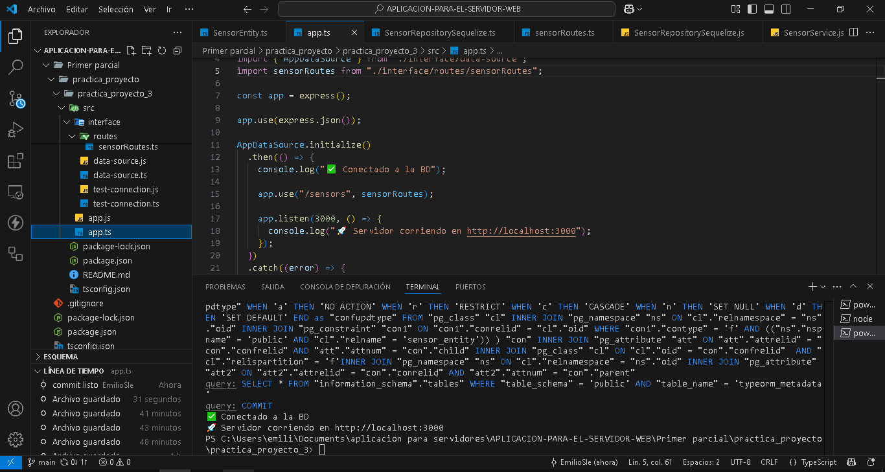

# Sensor Service API

Este es un servicio backend desarrollado con **Node.js**, **Express**, **TypeScript** y **TypeORM**. Gestiona sensores que registran datos como tipo, valor y fecha/hora del registro. Es parte de un sistema Agrotech más amplio que monitorea información ambiental.

## 📦 Tecnologías

- [Node.js](https://nodejs.org/)
- [Express](https://expressjs.com/)
- [TypeScript](https://www.typescriptlang.org/)
- [TypeORM](https://typeorm.io/)
- [PostgreSQL](https://www.postgresql.org/) u otro motor SQL compatible

---

## 📝 Características

- Crear sensores (tipo, valor, timestamp)
- Consultar todos los sensores registrados
- Uso de UUID como ID de sensor
- Conexión a base de datos relacional con TypeORM

---

## 🚀 Instalación

1. **Clona el repositorio:**

```bash
git clone https://github.com/tu-usuario/tu-repo.git
cd tu-repo

cd tu-repo
Instala dependencias:
npm install

Configura la base de datos:

Edita el archivo src/interface/data-source.ts con tus credenciales:


const AppDataSource = new DataSource({
  type: "postgres",
  host: "localhost",
  port: 5432,
  username: "tu_usuario",
  password: "tu_contraseña",
  database: "sensor_db",
  synchronize: true,
  entities: [SensorEntity],
});

También puedes usar .env con dotenv si prefieres variables de entorno.

Compila TypeScript:
npx tsc


Inicia el servidor:
node dist/app.js


También puedes usar ts-node para desarrollo sin compilar:
npx ts-node src/app.ts