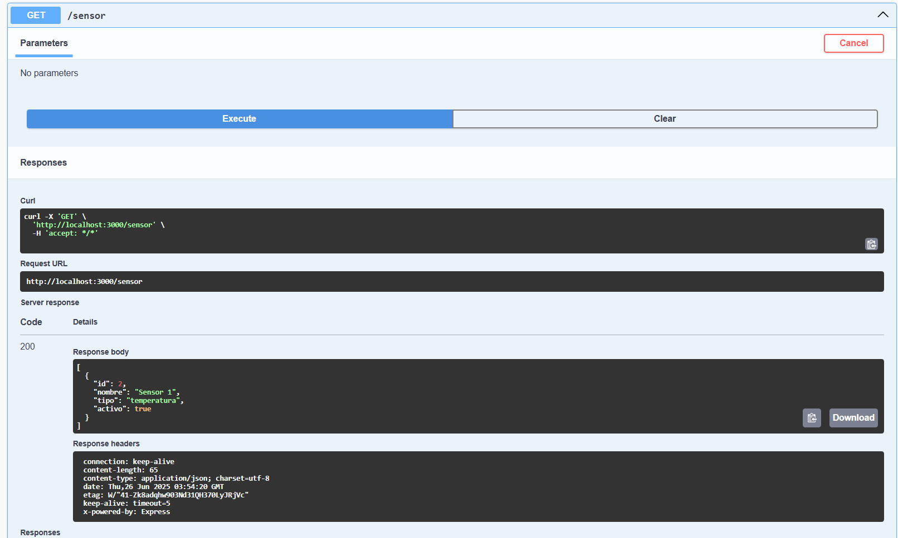
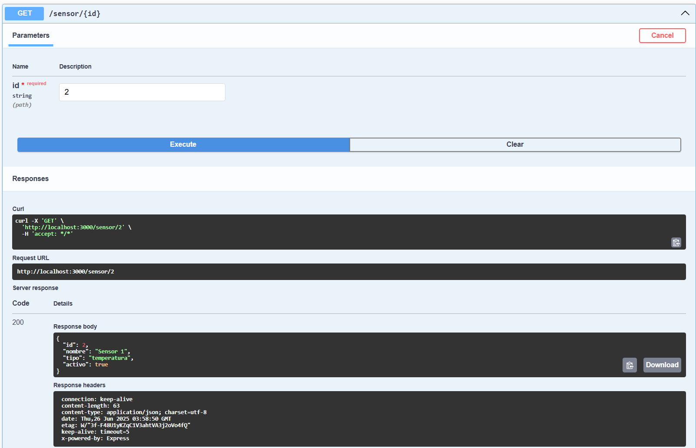
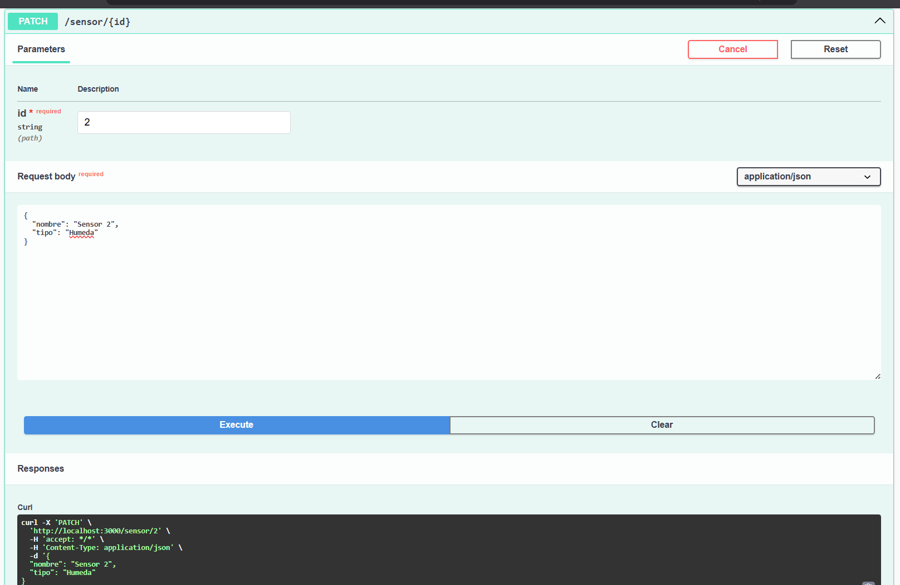
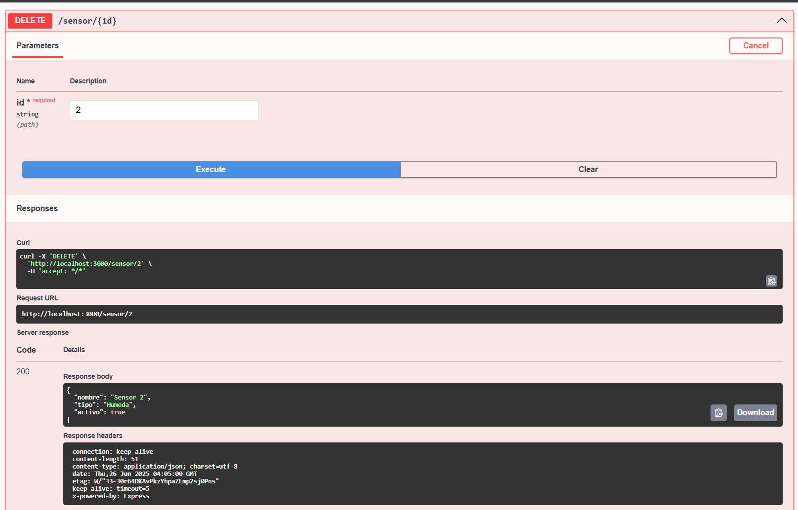

NestJS para Sensores, Lecturas y Ubicaciones

<p align="center">  
  <a href="https://nestjs.com/" target="_blank">  
      
  </a>  
</p>

---

## 📌 Descripción

Este proyecto es una API REST desarrollada con NestJS que permite gestionar sensores, lecturas y ubicaciones.  
Está diseñada para ser eficiente y fácil de escalar, utilizando SQLite como base de datos en desarrollo.

---

## 🚀 Instalación

Clona el repositorio y accede al directorio del proyecto:

```bash
git clone https://github.com/EmilioSle/APLICACION-PARA-EL-SERVIDOR-WEB.git
cd APLICACION-PARA-EL-SERVIDOR-WEB/Segundo_Parcial/practica/practica1
npm install
```

---
## ✅ Dependencias necesarias para tu proyecto

    npm install @nestjs/typeorm typeorm sqlite3
    npm install class-validator class-transformer
    npm install @nestjs/swagger swagger-ui-express

```

---

## ▶️ Uso

Ejecuta la aplicación en modo desarrollo:

```bash
npm run start:dev
```

La API estará disponible en: [http://localhost:3000](http://localhost:3000)

---

## 📡 Endpoints disponibles

| Recurso       | Método HTTP | Descripción                      |
|---------------|-------------|----------------------------------|
| `/sensor`     | GET         | Obtener todos los sensores       |
| `/sensor`     | POST        | Crear un nuevo sensor            |
| `/sensor/:id` | GET         | Obtener un sensor por ID         |
| `/sensor/:id` | PATCH       | Actualizar un sensor por ID      |
| `/sensor/:id` | DELETE      | Eliminar un sensor por ID        |
| `/lectura`    | GET         | Obtener todas las lecturas       |
| `/lectura`    | POST        | Crear una nueva lectura          |
| `/lectura/:id`| GET         | Obtener una lectura por ID       |
| `/lectura/:id`| PATCH       | Actualizar una lectura por ID    |
| `/lectura/:id`| DELETE      | Eliminar una lectura por ID      |
| `/ubicacion`  | GET         | Obtener todas las ubicaciones    |
| `/ubicacion`  | POST        | Crear una nueva ubicación        |
| `/ubicacion/:id` | GET      | Obtener una ubicación por ID     |
| `/ubicacion/:id` | PATCH    | Actualizar una ubicación por ID  |
| `/ubicacion/:id` | DELETE   | Eliminar una ubicación por ID    |

---

## 🧪 Pruebas

### Ejecutar pruebas unitarias:
```bash
npm run test
```

### Ejecutar pruebas end-to-end (e2e):
```bash
npm run test:e2e
```

### Ver cobertura de pruebas:
```bash
npm run test:cov
```

---

## 🛠️ Recursos útiles

- 📘 [Documentación oficial de NestJS](https://docs.nestjs.com/)
- 💬 [Discord oficial NestJS](https://discord.gg/nestjs)
- 🎓 [Cursos oficiales de NestJS](https://courses.nestjs.com/)

---


## Prueba de los 15 Endpoints

| Recurso       | Método HTTP | Descripción                      |
|---------------|-------------|----------------------------------|
| `/sensor`     | GET         | Obtener todos los sensores       |
Primero hay que hacer un post para poder obtener 


| `/sensor`     | POST        | Crear un nuevo sensor            |
Ejemplo de json
    {
    "nombre": "Sensor 1",
    "tipo": "temperatura"
    }


| `/sensor/:id` | GET         | Obtener un sensor por ID         |
Tambien se puede obtener sensor por ID


| `/sensor/:id` | PATCH       | Actualizar un sensor por ID      |
Para Actualizar se necesita el ID


| `/sensor/:id` | DELETE      | Eliminar un sensor por ID        |
Para Eliminar se necesita el ID


Asi mismo con el resto de los endpoint

---

## 👨‍💻 Autor

Autor: **Emilio Cardenas**.  
Repositorio original: [https://github.com/EmilioSle/APLICACION-PARA-EL-SERVIDOR-WEB](https://github.com/EmilioSle/APLICACION-PARA-EL-SERVIDOR-WEB)


---

Gracias por visitar este proyecto. ¡Feliz codificación! 🚀

