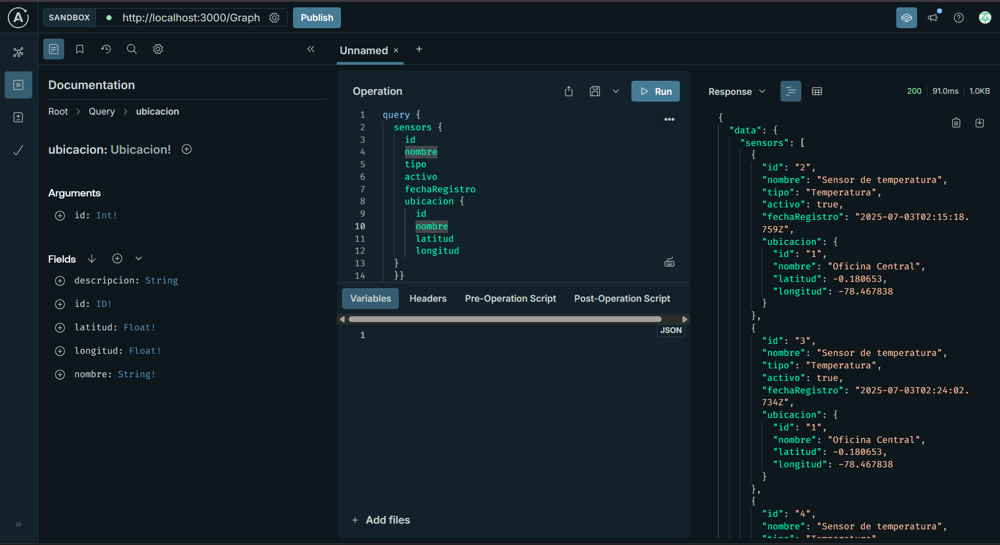
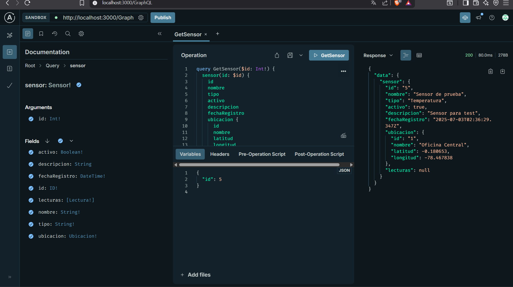
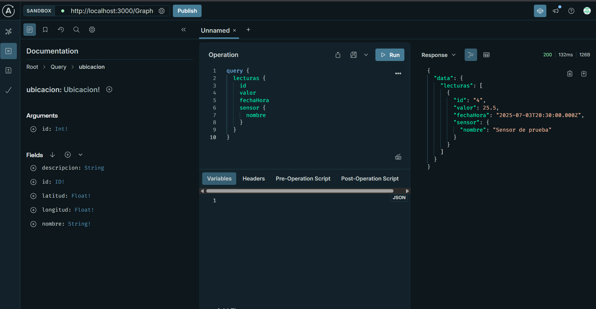
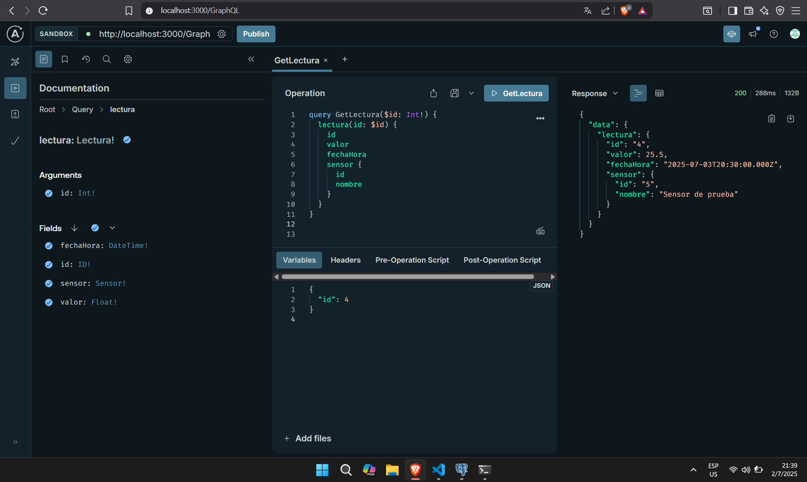
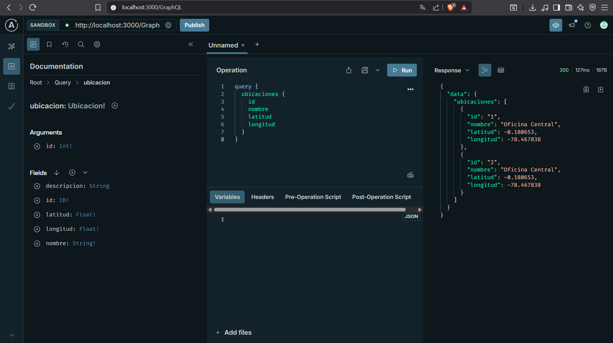
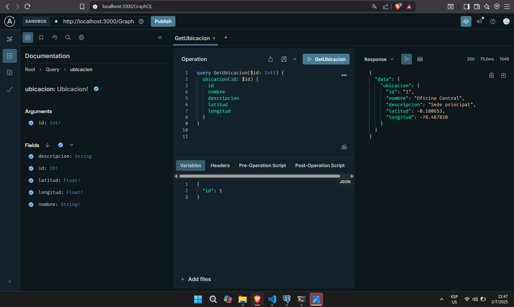
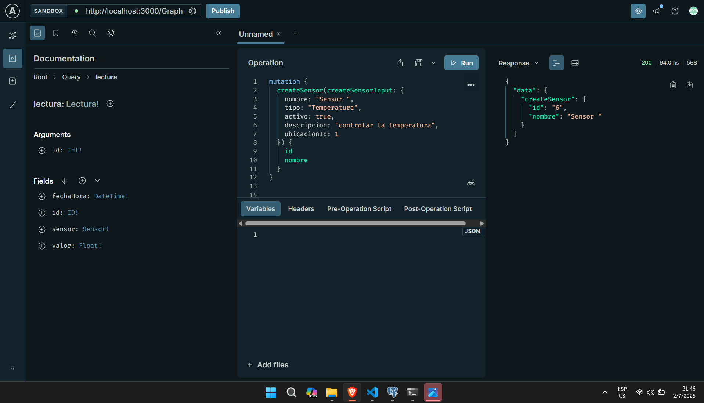
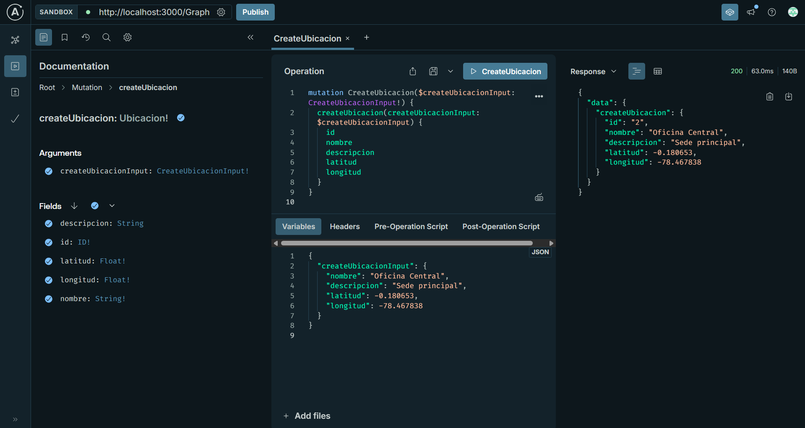

<p align="center">  
  <a href="https://nestjs.com/" target="_blank">  
      
  </a>  
</p>

<h1 align="center">🌐 API GraphQL con NestJS - Gestión de Sensores</h1>

---

## 📌 Descripción

API GraphQL construida con **NestJS** para gestionar **Sensores**, **Lecturas** y **Ubicaciones**.  
Permite crear, consultar, actualizar y eliminar estos recursos utilizando **tipos fuertemente tipados** y **validaciones automáticas**.

---

## 🚀 Instalación

Clona el repositorio y navega al directorio del proyecto:

```bash
git clone https://github.com/EmilioSle/APLICACION-PARA-EL-SERVIDOR-WEB.git
cd APLICACION-PARA-EL-SERVIDOR-WEB/Segundo_Parcial/practica/practica2
npm install
```

---

## ▶️ Uso

Ejecuta el servidor en modo desarrollo:

```bash
npm run start:dev
```

La API GraphQL estará disponible en:  
👉 [`http://localhost:3000/graphql`](http://localhost:3000/graphql)

Puedes probar las **queries** y **mutaciones** en **GraphQL Playground** o **Apollo Sandbox**.

---

## 📡 Esquema GraphQL Básico

### 🔷 Tipos principales

```graphql
type Sensor {
  id: ID!
  nombre: String!
  tipo: String!
  descripcion: String
  activo: Boolean!
  fechaRegistro: DateTime!
  ubicacion: Ubicacion!
  lecturas: [Lectura!]!
}

type Lectura {
  id: ID!
  valor: Float!
  fechaHora: DateTime!
  sensor: Sensor!
}

type Ubicacion {
  id: ID!
  nombre: String!
  descripcion: String
  latitud: Float!
  longitud: Float!
}
```

---

## 📥 Queries Disponibles

### 🔍 Obtener todos los sensores

```graphql
query {
  sensores {
    id
    nombre
    tipo
    activo
    fechaRegistro
    ubicacion {
      id
      nombre
      latitud
      longitud
    }
  }
}
```


### 🔍 Obtener sensor por ID

```graphql
query getSensor($id: Int!) {
  sensor(id: $id) {
    id
    nombre
    tipo
    descripcion
    activo
    fechaRegistro
    ubicacion {
      nombre
      latitud
      longitud
    }
    lecturas {
      valor
      fechaHora
    }
  }
}
```

### 🔍 Obtener todas las lecturas

```graphql
query {
  lecturas {
    id
    valor
    fechaHora
    sensor {
      nombre
    }
  }
}
```

### 🔍 Obtener lectura por ID

```graphql
query getLectura($id: Int!) {
  lectura(id: $id) {
    id
    valor
    fechaHora
    sensor {
      nombre
    }
  }
}
```

### 🔍 Obtener todas las ubicaciones

```graphql
query {
  ubicaciones {
    id
    nombre
    latitud
    longitud
  }
}
```

### 🔍 Obtener ubicación por ID

```graphql
query getUbicacion($id: Int!) {
  ubicacion(id: $id) {
    id
    nombre
    descripcion
    latitud
    longitud
  }
}
```

---

## ✏️ Mutaciones Disponibles

### ➕ Crear un sensor

```graphql
mutation createSensor($createSensorInput: CreateSensorInput!) {
  createSensor(createSensorInput: $createSensorInput) {
    id
    nombre
    tipo
  }
}
```

**Ejemplo de variables:**

```json
{
  "createSensorInput": {
    "nombre": "Sensor Temperatura Sala",
    "tipo": "Temperatura",
    "descripcion": "Sensor en sala de servidores",
    "activo": true,
    "fechaRegistro": "2025-07-03T20:00:00Z",
    "ubicacionId": 1
  }
}
```

---

### ➕ Crear una lectura

```graphql
mutation createLectura($createLecturaInput: CreateLecturaInput!) {
  createLectura(createLecturaInput: $createLecturaInput) {
    id
    valor
    fechaHora
  }
}
```

**Ejemplo de variables:**

```json
{
  "createLecturaInput": {
    "valor": 25.5,
    "fechaHora": "2025-07-03T20:30:00Z",
    "sensorId": 1
  }
}
```

---

### ➕ Crear una ubicación

```graphql
mutation createUbicacion($createUbicacionInput: CreateUbicacionInput!) {
  createUbicacion(createUbicacionInput: $createUbicacionInput) {
    id
    nombre
    latitud
    longitud
  }
}
```

**Ejemplo de variables:**

```json
{
  "createUbicacionInput": {
    "nombre": "Sala de servidores",
    "descripcion": "Ubicación principal del sensor",
    "latitud": -0.180653,
    "longitud": -78.467838
  }
}
```

---

## 🛠️ Notas Importantes

- Primero **crea las ubicaciones** y luego los sensores antes de registrar lecturas, para cumplir con las **claves foráneas**.
- Los campos `fechaRegistro` y `fechaHora` deben usar el formato **ISO 8601**:  
  `YYYY-MM-DDTHH:mm:ssZ`
- Puedes usar el **GraphQL Playground** o **Apollo Sandbox** para probar tus operaciones.

---

## 👨‍💻 Autor

**Emilio Cárdenas**  
🔗 Repositorio: [github.com/EmilioSle/APLICACION-PARA-EL-SERVIDOR-WEB](https://github.com/EmilioSle/APLICACION-PARA-EL-SERVIDOR-WEB)
